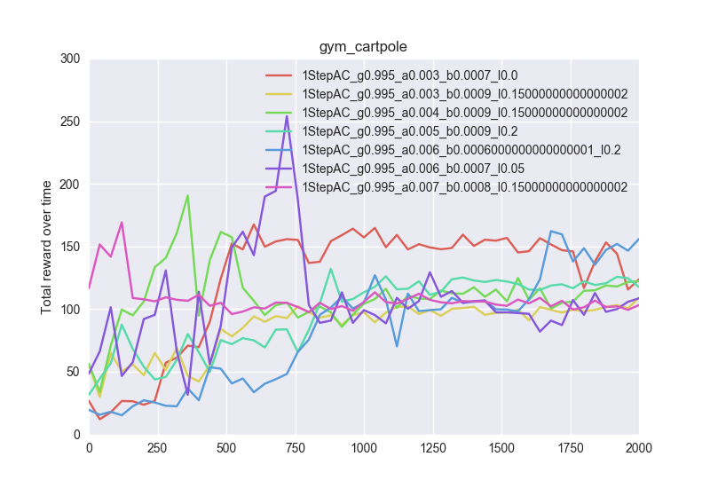

# Actor-Critic Methods

This project implements a simple actor-critic method (with the critic being Sarsa(lambda) and the actor using a Boltzmann distribution) on the OpenAI CartPole environment. Values were tuned for the parameters of lambda, alpha (critic learning rate) and beta (actor learning rate). Gamma was set to 0.995.

The graph was produced by running the following command:

cd src; python3 main.py; python3 graphs.py

The following sources were used as references:
* General policy functions (e.g. greedy q-policy)
	* Keras-RL library.
* Basis for actor-critic method, including copy of the Boltzmann action sampling function:
	* https://github.com/gauthamvasan/OpenAI-Gym/blob/master/Cartpole/linear_ACRL.py
* CartPole environment (the wrapper is my own)
	* OpenAI gym
* State-action features for CartPole state
	* https://gym.openai.com/evaluations/eval_JeP6rWUQ8KuT8HB0YcR3g

